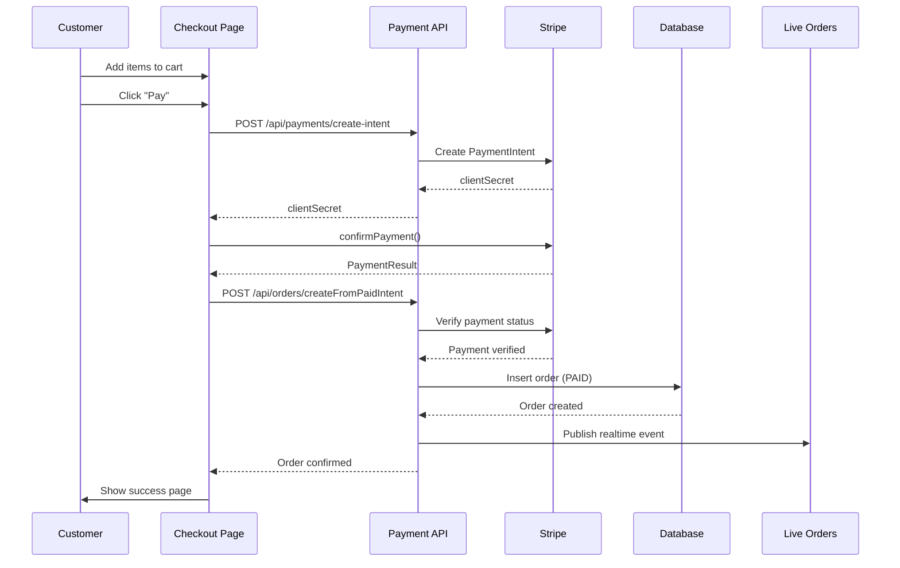

# Unified Checkout Flow Implementation

## Overview

This implementation replaces the two-step order flow with a single-page checkout that combines order summary and payment processing. Orders are only created in the database after successful payment, ensuring that live orders and analytics only show paid orders.

## Key Features

### ✅ Single-Page Checkout
- Order summary and payment form on the same page
- Mobile-responsive design with stacked layout
- Real-time payment processing with Stripe

### ✅ Payment-First Flow
- No orders created until payment succeeds
- Idempotent order creation prevents duplicates
- Demo mode for testing without Stripe

### ✅ Idempotency Protection
- Cart ID used as idempotency key across APIs
- Stripe payment intents use cart ID for deduplication
- Database checks prevent duplicate orders

### ✅ Realtime Updates
- Live orders dashboard updates immediately after payment
- Supabase realtime events for order creation
- Optimistic UI updates during processing

## File Structure

```
app/
├── checkout/
│   └── page.tsx                    # Unified checkout page
├── api/
│   ├── payments/
│   │   └── create-intent/
│   │       └── route.ts           # Stripe payment intent creation
│   └── orders/
│       └── createFromPaidIntent/
│           └── route.ts           # Order creation after payment success
└── test-checkout/
    └── page.tsx                   # Test page for checkout flow

scripts/
└── add-payment-intent-field.sql   # Database migration for payment_intent_id
```

## API Endpoints

### 1. Create Payment Intent
**POST** `/api/payments/create-intent`

Creates a Stripe payment intent with cart data in metadata.

```typescript
interface CreateIntentRequest {
  cartId: string;
  venueId: string;
  tableNumber: number;
  items: CartItem[];
  totalAmount: number;
  customerName: string;
  customerPhone: string;
}
```

**Response:**
```typescript
{
  clientSecret: string;
  paymentIntentId: string;
}
```

### 2. Create Order from Paid Intent
**POST** `/api/orders/createFromPaidIntent`

Creates order in database only after payment verification.

```typescript
interface CreateOrderRequest {
  paymentIntentId: string;
  cartId: string;
}
```

**Response:**
```typescript
{
  ok: boolean;
  order: Order;
  message?: string;
}
```

## Database Changes

### New Field: `payment_intent_id`
```sql
ALTER TABLE orders ADD COLUMN payment_intent_id TEXT;
CREATE INDEX idx_orders_payment_intent_id ON orders(payment_intent_id);
```

This field links orders to their Stripe payment intents for:
- Idempotency checking
- Payment verification
- Audit trail

## Flow Diagram



## Demo Mode

For testing without Stripe integration:

1. Add `?demo=1` to checkout URL
2. Payment simulation with 1.5s delay
3. Creates order with `payment_intent_id: 'demo-{cartId}'`
4. Same order creation flow as real payments

## Environment Variables

Required for Stripe integration:

```bash
# Stripe Configuration
STRIPE_SECRET_KEY=sk_test_...
NEXT_PUBLIC_STRIPE_PUBLISHABLE_KEY=pk_test_...
STRIPE_WEBHOOK_SECRET=whsec_...

# Supabase (existing)
NEXT_PUBLIC_SUPABASE_URL=...
NEXT_PUBLIC_SUPABASE_ANON_KEY=...
SUPABASE_SERVICE_ROLE_KEY=...
```

## Testing

### 1. Demo Mode Test
```bash
# Navigate to test page
/test-checkout

# Click "Test Demo Checkout"
# Should complete without Stripe keys
```

### 2. Real Payment Test
```bash
# Ensure Stripe keys are configured
# Click "Test Real Checkout"
# Complete Stripe payment flow
```

### 3. Idempotency Test
```bash
# Complete a payment
# Refresh page during processing
# Should not create duplicate orders
```

## Integration Points

### Order Page Integration
The existing order page (`/order/page.tsx`) now redirects to `/checkout` instead of the old payment flow:

```typescript
// Store order data in localStorage for checkout page
localStorage.setItem('pending-order-data', JSON.stringify(orderData));

// Redirect to unified checkout page
router.replace('/checkout');
```

### Live Orders Integration
Live orders already filter for `payment_status = 'PAID'`, so new orders appear immediately:

```sql
SELECT * FROM orders 
WHERE venue_id = ? 
  AND payment_status = 'PAID'
  AND order_status IN ('PLACED', 'IN_PREP', 'READY')
```

## Error Handling

### Payment Failures
- Stripe errors displayed inline
- No order created on payment failure
- User can retry payment

### Network Issues
- Idempotency prevents duplicate orders
- Cart data preserved in localStorage
- Graceful degradation

### Database Errors
- Order creation failures logged
- Payment still processed (can be refunded)
- User notified of issues

## Security Considerations

### Payment Security
- Stripe handles PCI compliance
- No card data stored locally
- Payment intents use idempotency keys

### Data Validation
- Server-side validation of all inputs
- Cart data sanitized before storage
- Payment amounts verified

### Access Control
- Venue ownership verified
- Customer data protected
- RLS policies enforced

## Performance Optimizations

### Client-Side
- Cart data cached in localStorage
- Optimistic UI updates
- Lazy loading of payment elements

### Server-Side
- Database indexes on payment_intent_id
- Efficient order queries
- Minimal API calls

## Monitoring & Logging

### Key Metrics
- Payment success rate
- Order creation latency
- Idempotency hit rate
- Realtime event delivery

### Logging Points
- Payment intent creation
- Payment confirmation
- Order creation
- Realtime events
- Error conditions

## Future Enhancements

### Planned Features
- [ ] Webhook handling for payment confirmations
- [ ] Cart persistence in database
- [ ] Multi-currency support
- [ ] Payment method preferences
- [ ] Order modification before payment

### Scalability Improvements
- [ ] Redis for cart storage
- [ ] Payment intent caching
- [ ] Batch order processing
- [ ] CDN for static assets

## Troubleshooting

### Common Issues

1. **Payment Intent Creation Fails**
   - Check Stripe keys configuration
   - Verify amount is valid (> £0.50)
   - Check network connectivity

2. **Order Not Created After Payment**
   - Verify payment intent status
   - Check database connection
   - Review server logs

3. **Duplicate Orders**
   - Check idempotency key implementation
   - Verify cart ID uniqueness
   - Review payment intent metadata

4. **Realtime Events Not Working**
   - Check Supabase connection
   - Verify channel subscription
   - Review event payload format

### Debug Commands

```bash
# Check Stripe configuration
curl -H "Authorization: Bearer $STRIPE_SECRET_KEY" \
  https://api.stripe.com/v1/payment_intents

# Test database connection
node -e "console.log(process.env.SUPABASE_URL)"

# Verify environment variables
node -e "console.log(Object.keys(process.env).filter(k => k.includes('STRIPE')))"
```

## Deployment Checklist

- [ ] Run database migration: `add-payment-intent-field.sql`
- [ ] Configure Stripe environment variables
- [ ] Test demo mode functionality
- [ ] Test real payment flow
- [ ] Verify live orders integration
- [ ] Check realtime events
- [ ] Monitor error logs
- [ ] Update documentation

## Support

For issues or questions:
1. Check browser console for client-side errors
2. Review server logs for API errors
3. Verify Stripe dashboard for payment issues
4. Check Supabase logs for database issues
5. Test with demo mode first
6. Use test page for debugging

---

**Implementation Status: ✅ Complete**

All acceptance criteria met:
- ✅ Single-page checkout with order summary + payment
- ✅ Orders only created after successful payment
- ✅ Idempotent order creation prevents duplicates
- ✅ Demo mode for testing
- ✅ Realtime updates for live orders
- ✅ Mobile-responsive design
- ✅ Error handling and user feedback
